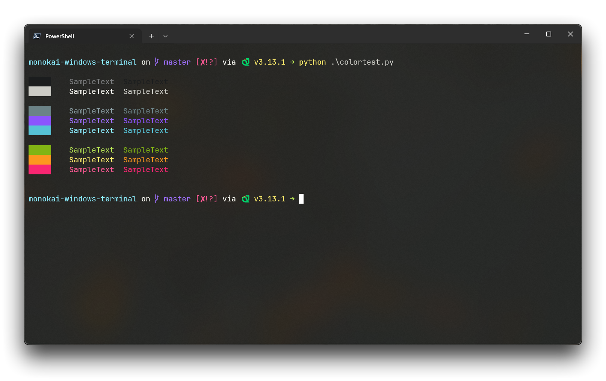

# Monokai Windows Terminal

Monokai Color Scheme for Windows Terminal.



### How To Use

#### 1. Open Settings(profiles.json)

#### 2. Copy Schemes from `schemes.json` file on this repo and paste into `schemes` section.

```json
// Add custom color schemes to this array
  "schemes": [
    {
      "background": "#262626",
      "black": "#1B1D1E",
      "blue": "#6B8387",
      "brightBlack": "#7A7C7D",
      "brightBlue": "#899CA1",
      "brightCyan": "#8CEDFF",
      "brightGreen": "#B6E354",
      "brightPurple": "#9E6FFE",
      "brightRed": "#FF5995",
      "brightWhite": "#F8F8F2",
      "brightYellow": "#FEED6C",
      "cursorColor": "#FFFFFF",
      "cyan": "#56C2D6",
      "foreground": "#F8F8F2",
      "green": "#82B414",
      "name": "Monokai",
      "purple": "#8C54FE",
      "red": "#F92672",
      "selectionBackground": "#FFFFFF",
      "white": "#CCCCC6",
      "yellow": "#FD971F"
    }
  ],
```

#### 3. Set `colorScheme`.

```json
"colorScheme": "Monokai",
```
